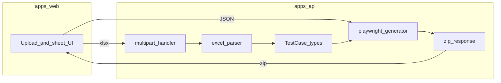

# Excel → JSON → Playwright 코드 생성 계획

## 현재 코드베이스와의 관계

- 이미 [`apps/api/src/specGenerator.ts`](apps/api/src/specGenerator.ts)가 `Step[]` → 단일 `test("scenario", …)` 스펙을 생성합니다. 이는 **녹화/빌더 시나리오 모델**(`scenarioStore`의 `Step`, 다양한 `selectorStrategy`)에 맞춰 있습니다.
- PRD의 **Excel TestCase 모델**(feature / scenarios / steps / assertions, **getByTestId 고정**)은 구조가 다르므로, **새 타입 + 새 생성기**로 두는 것이 설계 원칙(3단 분리, deterministic)에 맞습니다. 기존 생성기를 깨지 않고 병행합니다.

## 기술 선택 (저장소 정합)

| 항목   | 선택                                                                                                                                                                                                                             |
| ------ | -------------------------------------------------------------------------------------------------------------------------------------------------------------------------------------------------------------------------------- |
| 프론트 | PRD에 Vue3가 있으나 본 저장소는 **React + Vite**([`apps/web`](apps/web)). **MVP는 `apps/web`에 업로드·시트 선택·JSON 미리보기·ZIP 다운로드 UI를 추가**하는 것이 일관됩니다. (향후 Vue 패키지 분리는 Phase 2로 문서화만 해도 됨.) |
| Excel  | `xlsx`(SheetJS 커뮤니티) — `apps/api` 의존성 추가.                                                                                                                                                                               |
| 업로드 | `@fastify/multipart`로 `.xlsx` 수신.                                                                                                                                                                                             |
| ZIP    | `archiver`로 `generated-tests/*.spec.ts` 묶음 응답.                                                                                                                                                                              |

## 데이터 모델 (PRD 스키마 고정)

[`apps/api/src`](apps/api/src)에 전용 타입 파일을 둡니다 (예: `excelTestCaseTypes.ts`).

- `TestCase`: `{ feature, scenarios[] }`
- `Scenario`: `{ name, steps[], assertions[] }`
- `Step`: `action: 'click' | 'input' | 'navigate'`, `target`, `value?`
- `Assertion`: `type: 'visible' | 'text' | 'url'`, `target?`, `expected?`

런타임에서 `zod` 등으로 검증할지는 팀 취향이나; **최소한** 파서 출력 직후 구조 검증 함수로 타입 가드 + 명시적 에러를 권장합니다.

## Excel 파서 동작

**입력 규칙**

- 시트 이름 → `feature` 문자열.
- 헤더 행: `테스트명`, `action`, `target`, `value`, `assertion` (별칭/대소문자 허용 여부는 첫 행 trim 기준으로 매핑 테이블 권장).
- 같은 `테스트명` 연속 그룹 → 하나의 `Scenario` (시트 내 순서 유지).
- 각 데이터 행 → `Step` 및/또는 `Assertion`으로 분해.

**PRD 예외와 실무 보완 (권장)**

- `action` 없음: 기본은 **skip** + 로그에 `warning`.
- **`assertion` 컬럼만 있는 행**: QA 템플릿에서 흔하므로, **action이 비어 있고 `assertion`이 있으면 assertion 행으로 처리**하고, 둘 다 비면 skip. (PRD 엄격 모드가 필요하면 env 플래그로 `strict_skip`만 허용 가능.)
- `target` 없음: step/assertion에서 필요한 경우 **error** (시트/행 번호 포함).
- 시나리오 종료 시 `assertions` 비어 있음 → **warning** (시나리오 단위).

**Assertion 컬럼 파싱**

- 단순 규칙 예: `visible:myinfo-page`, `text:el:기대문`, `url:https://…` 형태의 미니 DSL, 또는 `visible` + `target` 별도 열만 쓰는 템플릿 문서 병행.
- deterministic 하게 **하나의 공식 문법**을 README/템플릿 xlsx에 고정.

## Playwright 코드 생성 (전용 모듈)

새 파일 예: [`apps/api/src/excelPlaywrightGenerator.ts`](apps/api/src/excelPlaywrightGenerator.ts)

- `generateSpecFile(feature: string, scenarios: Scenario[]): string` — PRD 예시와 동일한 스타일:
  - `import { test, expect } from '@playwright/test'`
  - `test.describe(feature, () => { … })`
  - 시나리오별 `test(name, async ({ page }) => { … })`
- **문자열 이스케이프**: 시나리오 이름·testId·URL·텍스트는 모두 **템플릿 리터럴 금지**, `JSON.stringify` 기반 삽입으로 injection/깨짐 방지.
- **파일명**: `${sanitizeFileName(feature)}.spec.ts` — OS 금지문자 제거, 빈 이름 방지.

매핑은 PRD 그대로:

- `click` → `await page.getByTestId('…').click()`
- `input` → `fill` with `value`
- `navigate` → `page.goto(value)` (target 무시 또는 검증만 — PRD는 `value`에 URL)

Assertion:

- `visible` → `expect(page.getByTestId(target)).toBeVisible()`
- `text` → `toHaveText(expected)` (target 필수)
- `url` → `expect(page).toHaveURL(expected)` (target 불필요)

## API 설계

[`apps/api/src/index.ts`](apps/api/src/index.ts)에 라우트 추가 (CORS는 이미 설정됨).

1. **`POST /api/excel/parse`**
   - multipart: `file` (.xlsx), optional `sheetNames` (JSON 문자열 또는 반복 필드).
   - 응답: `{ features: TestCase[], diagnostics: { errors[], warnings[] } }`
   - 시트 목록만 필요할 때: **`GET /api/excel/sheets`** 대신, 클라이언트가 브라우저에서 `xlsx`로 시트명만 읽는 방식도 가능하나, **서버 단일 진실원**을 원하면 `parse`의 dry-run 모드 또는 별도 경량 엔드포인트 추가.

2. **`POST /api/excel/generate`**
   - body: `{ testCases: TestCase[] }` (또는 parse 세션 id — MVP는 body 직접이 단순).
   - 응답: `application/zip` attachment `generated-tests.zip` 또는 JSON에 각 파일명+내용(base64) — **ZIP 바이너리**가 UX에 유리.

3. **로컬 저장 (선택)**: `data/generated-tests/<uuid>/`에 쓰고 URL 제공 — PRD의 “파일 생성”과 맞춤. MVP는 ZIP 다운로드만으로도 충분.

## 프론트엔드 (`apps/web`)

- 새 라우트/섹션(예: “Excel → Playwright”): **Drag & Drop** + 파일 input, **시트 체크박스**(워크북은 브라우저에서 `xlsx`로 시트명 나열 후 선택 가능, 또는 parse API로 시트 목록).
- 흐름: 업로드 → `POST /api/excel/parse` → JSON 미리보기(접기) → “ZIP 생성” → `POST /api/excel/generate` → `blob` 다운로드.
- 기존 [`apps/web/vite.config.ts`](apps/web/vite.config.ts)의 `/api` 프록시 활용.

## 테스트 (사용자 규칙: 리졸버 단위)

- [`apps/api/src`](apps/api/src)에 **단위 테스트** 추가 (기존 [`codegenToSteps.test.ts`](apps/api/src/codegenToSteps.test.ts) 패턴):
  - 가짜 워크북 행 배열 → 파서 → 기대 `TestCase`
  - `TestCase` → 생성 문자열 스냅샷 또는 포함 라인 assert
  - 에러/워닝 케이스: target 누락, action 없음, assertion 없는 시나리오

(실제 `.xlsx` 바이너리 fixture는 선택; 최소는 **파서에 “행 배열” 진입점**을 두고 시트→rows는 thin wrapper로 테스트.)

## 의존성

- `apps/api/package.json`: `xlsx`, `@fastify/multipart`, `archiver` (+ `@types/archiver` 필요 시)

## 아키텍처 요약

## 리스크 (PRD 9절과 정렬)

- **엑셀 열 이름 변형**: 헤더 매핑 테이블 + 템플릿 제공.
- **한글/특수문자 파일명**: sanitize + 충돌 시 suffix.
- **MVP vs UI**: PRD 10절이 “UI 대시보드 제외”라면, **업로드만 있는 단일 페이지**는 “대시보드”가 아니라 도구 페이지로 간주 가능; 완전 무UI면 `curl -F` 예시만 README에 추가.
