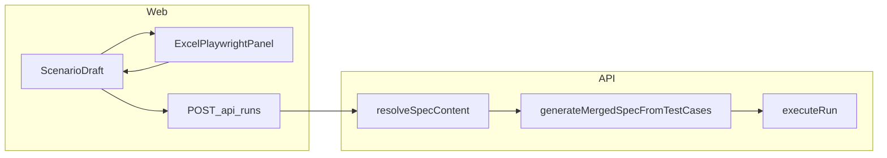

# Excel TC를 시나리오 내부로 옮기고 JSON으로 바로 실행

## 현재 상태

- UI: [`apps/web/src/App.tsx`](apps/web/src/App.tsx)에서 `AppTab`이 `scenarios` | `excel`이며, `excel`일 때 [`ExcelPlaywrightPanel`](apps/web/src/components/ExcelPlaywrightPanel.tsx)만 전체 화면으로 표시됩니다.
- 실행: [`apps/api/src/index.ts`](apps/api/src/index.ts)의 `resolveSpecContent`는 `rawScript` → 인라인 `steps` → 저장된 시나리오의 스크립트/스텝만 처리합니다. Excel JSON 경로는 없습니다.
- `executeRun`은 [`TEST_DIR` 아래 `scenario.spec.ts` 한 파일](apps/api/src/index.ts)만 작성합니다.
- Excel → TS 변환은 이미 [`generateSpecFilesFromTestCases`](apps/api/src/excelPlaywrightGenerator.ts) / `generateSpecFileContent`로 시트(정책)별 파일을 만듭니다. 런너는 단일 디렉터리 + 한 번의 `playwright test`이므로, **여러 `ExcelTestCase`를 import 한 줄 + `test.describe` 블록만 이어붙인 단일 spec 문자열**이 필요합니다(새 헬퍼 `generateMergedSpecFromTestCases` 권장).

## 동작 규칙(제품)

- **저장**: 시나리오 JSON에 파싱 결과를 `excelTestCases`(타입은 기존 [`ExcelTestCase`](apps/api/src/excelTestCaseTypes.ts) 배열, parse 응답의 `features`와 동일)로 둡니다. `PUT /api/scenarios/:id`와 웹 `저장` 본문에 포함합니다.
- **실행 우선순위**: 요청 본문에 `excelTestCases`가 있고 길이가 0보다 크면 **그것을 사용**합니다. 없으면 저장된 시나리오를 읽었을 때 `excelTestCases`가 있으면 그것을 사용합니다. 그 외는 **기존과 동일**하게 `rawScript` → `steps` → 시나리오의 스크립트/스텝 순입니다.
  - 한 시나리오에 빌더 스텝과 Excel TC가 동시에 있을 때는 **Excel이 비어 있지 않으면 Excel 실행**으로 단순화합니다. Excel 없이 빌더만 쓰려면 사용자가 Excel TC를 비우면 됩니다(UI에 «Excel TC 지우기» 또는 JSON 편집으로 충분).
- **미저장 편집**: `startRun` 시 클라이언트가 현재 draft의 `excelTestCases`를 함께 보내 저장 전에도 파싱 직후 실행 가능하게 합니다.

## 백엔드 변경

1. **[`apps/api/src/scenarioStore.ts`](apps/api/src/scenarioStore.ts)**
   - `Scenario`에 `excelTestCases?: ExcelTestCase[]`(또는 필수 + 기본 `[]`) 추가.
   - `createScenario` / `updateScenario`의 patch 타입에 반영. 기존 `.json` 파일은 필드 없음 → 읽을 때 `?? []`로 호환.

2. **[`apps/api/src/excelPlaywrightGenerator.ts`](apps/api/src/excelPlaywrightGenerator.ts)**
   - `generateMergedSpecFromTestCases(testCases: ExcelTestCase[]): string` 추가: 맨 위에 `import { test, expect } from "@playwright/test";` 한 번만, 이어서 각 TC에 대해 `generateSpecFileContent`에서 **import와 마지막 공백을 제외한 본문**을 붙이거나, 내부적으로 `describe` 블록만 생성하는 소 private 헬퍼로 중복 제거.

3. **[`apps/api/src/index.ts`](apps/api/src/index.ts)**
   - `resolveSpecContent` 인자 확장: `excelTestCases?: ExcelTestCase[]`, 시나리오 로드 시 동일 필드 고려.
   - `POST /api/runs` body 타입에 `excelTestCases` 추가; 검증은 기존 [`parseTestCasesFromJsonBody`](apps/api/src/excelBodyValidate.ts)(또는 동일 스키마 검사) 재사용 가능하면 재사용.
   - [`expectedSpecSnapshotForScenario`](apps/api/src/index.ts): 시나리오에 `excelTestCases`가 있으면 병합 spec과 비교하도록 갱신해, 시나리오별 실행 이력 필터가 깨지지 않게 합니다.

4. **문서**: [`README.md`](README.md)에 «Excel TC는 시나리오에 저장되며, 실행 시 `excelTestCases`가 있으면 해당 spec으로 실행» 한 절 추가.

## 프론트엔드 변경

1. **[`apps/web/src/App.tsx`](apps/web/src/App.tsx)**
   - 상단 `excel` 탭 및 `appTab` 상태 제거.
   - 시나리오가 선택된 경우 기존「빌더 / 스크립트」줄에 **세 번째 탭**(예: «업무 TC (Excel)») 추가; `editorTab` 타입을 `"builder" | "script" | "excel"`로 확장.
   - `switchTab`: `excel`일 때는 **`draft.mode`를 바꾸지 않거나**, 저장 호환을 위해 `mode`는 그대로 두고 탭만 분리하는 편이 안전합니다(기존 `mode`는 builder/script만 유지).

2. **[`apps/web/src/types.ts`](apps/web/src/types.ts)**
   - `Scenario`에 `excelTestCases` 배열 타입 추가(필드 shape는 API와 동일하게 인터페이스 정의; web은 api 패키지에 의존하지 않으므로 로컬 인터페이스 유지).

3. **[`apps/web/src/components/ExcelPlaywrightPanel.tsx`](apps/web/src/components/ExcelPlaywrightPanel.tsx)**
   - 제어 컴포넌트화: `excelTestCases`, `onExcelTestCasesChange` (파싱 성공 시·지울 때).
   - ZIP은 유지하되 `testCases` 소스는 부모 state 사용.
   - `handleSave`에 넘기도록 부모에서 `excelTestCases`를 PUT에 포함.

4. **`canRun` / `startRun`**
   - `canRun`: `(draft.excelTestCases?.length ?? 0) > 0` 이거나 기존 빌더/스크립트 조건.
   - `startRun`: `JSON.stringify`에 `excelTestCases` 포함(비어 있지 않을 때만내도 됨).

## 테스트

- API: `resolveSpecContent` 또는 런 진입 직전에 대응하는 작은 단위 테스트(병합 spec에 `test.describe`가 여러 번 포함되는지, import가 한 번인지).
- 기존 [`excelPlaywrightGenerator.test.ts`](apps/api/src/excelPlaywrightGenerator.test.ts)에 `generateMergedSpecFromTestCases` 케이스 추가.

## 범위 밖(명시적 비포함)

- Excel TC와 빌더를 한 실행에 섞는 복합 spec.
- `packages/playwright-runner`의 `testDir` glob 다중 파일 방식(단일 `scenario.spec.ts`로 충분).
