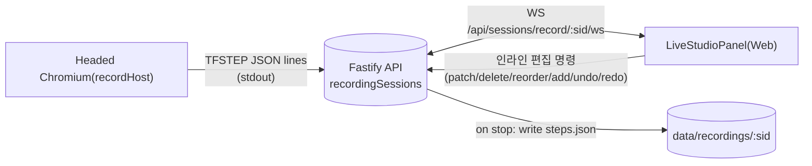

## 아키텍처 개요

핵심 전환:

- recordHost는 스텝을 stdout으로 **실시간 방출**만 하고, `steps.json`을 직접 쓰지 않음.
- API가 세션별 스텝 상태의 **단일 소유자**가 되어 WS로 브로드캐스트하고, 편집 명령을 처리하며, 종료 시 `steps.json`을 기록.
- 클라이언트는 서버 스냅샷 + 클라이언트 사이드 `generateSpec`으로 코드 프리뷰를 그린다(네트워크 왕복 최소화).

## 백엔드

### 1. 의존성 및 플러그인 등록

- [apps/api/package.json](apps/api/package.json): `@fastify/websocket` 추가.
- [apps/api/src/index.ts](apps/api/src/index.ts): 부팅 초기 `await fastify.register(websocketPlugin)` 호출.

### 2. recordHost의 스텝 스트리밍 전환

- [packages/playwright-runner/src/recordHost.ts](packages/playwright-runner/src/recordHost.ts):
  - `handleEvent`/`framenavigated`에서 스텝을 만들 때마다 `process.stdout.write("TFSTEP " + JSON.stringify(step) + "\n")`도 함께 출력.
  - 종료 시점의 `fs.writeFile(steps.json …)`은 **제거**. 파일 기록은 API가 전담.

### 3. recordingSessions 리팩터 — 세션 상태 & 편집 API

- [apps/api/src/recordingSessions.ts](apps/api/src/recordingSessions.ts):
  - `HostedSession`에 `steps: StepOut[]`, `past: StepOut[][]`, `future: StepOut[][]`, `subscribers: Set<(msg) => void>` 필드 추가.
  - `startHostedRecordSession` 내 stdout 파서: 라인 버퍼링하여 `TFSTEP ` 접두사 라인을 파싱해 `steps`에 push + `broadcast({ type: "step:added", step })`.
  - 편집 헬퍼 export (각 호출은 `past`에 snapshot push + `future=[]` + `broadcast({ type: "snapshot", steps })`):
    - `patchStep(sid, id, patch)` / `deleteStep(sid, id)` / `addStep(sid, step, atIndex?)` / `reorderSteps(sid, idsInOrder)` / `undo(sid)` / `redo(sid)` / `getSteps(sid)`.
  - `stopHostedRecordSession`:
    - 프로세스 종료 대기 후 **`steps` 상태를 `steps.json`으로 기록** (recordHost 기록 파일은 더 이상 참조 안 함).
    - 기존 반환 형식(`script`, `steps`, `parseWarnings`, `sessionArtifacts.videoUrl`) 유지 → `stopHostedRecordSession` 이후 흐름(smartTc 생성 등) 그대로 동작.

### 4. API 엔드포인트 (한 개의 WS + 소수의 REST 폴백)

- [apps/api/src/index.ts](apps/api/src/index.ts):
  - `GET /api/sessions/record/:sessionId/ws`
    - 연결 시 초기 `{ type: "snapshot", steps }` 전송.
    - 서버→클라 메시지: `step:added`, `snapshot`, `closed`.
    - 클라→서버 메시지(JSON): `{ type: "patch", id, patch }`, `delete`, `add`, `reorder`, `undo`, `redo`. 스위치문에서 `recordingSessions`의 해당 헬퍼 호출.
  - 재접속/디버깅용 REST:
    - `GET /api/sessions/record/:sid/steps` → 현재 스냅샷.
  - 기존 `POST /api/sessions/:sessionId/stop` 그대로 사용(편집 결과가 그대로 반영되므로 UI 변경 불필요).

## 프런트엔드

### 5. 공용 코드-젠 유틸 (클라이언트 사이드 미러)

- [apps/web/src/utils/generateSpec.ts](apps/web/src/utils/generateSpec.ts) 신규:
  - [apps/api/src/specGenerator.ts](apps/api/src/specGenerator.ts)의 `selectorToCode`/`generateSpec`와 동일 로직을 포팅(약 80줄).
  - 라이브 패널에서 각 스텝의 단일 라인(`stepToLine`)도 export — 리스트에서 스텝별로 그린다.

### 6. LiveStudioPanel (신규)

- [apps/web/src/components/LiveStudioPanel.tsx](apps/web/src/components/LiveStudioPanel.tsx) 신규:
  - props: `sessionId: string`, `onStop: () => void`, `recordUrl`.
  - 마운트 시 WS `/api/sessions/record/:sessionId/ws` 연결, `snapshot`/`step:added`를 수신해 `steps` 상태 유지.
  - 2-컬럼 레이아웃:
    - 좌: 드래그 가능한 스텝 리스트. 각 row에 `type` select(click/fill/goto/wait_ms/assert_visible/assert_hidden/assert_text/screenshot), `selectorStrategy` select, `selectorValue`/`inputValue`/`label` input, 삭제 버튼. 변경 시 WS `patch`/`delete` 전송(debounce 200ms).
    - 우: `generateSpec(steps)` 실시간 렌더 + 각 스텝 라인 호버 시 해당 row 하이라이트.
  - 툴바: `Undo`, `Redo`, `+ goto`, `+ wait`, `+ assert:visible`, `+ screenshot`, `순서변경(드래그)`.
  - 드롭 시 `reorder` 메시지 전송. 수동 추가는 현재 선택된 스텝 바로 아래 인덱스에 삽입.
  - 위 쪽에 "녹화 중… N개 기록됨" 헤더 + "녹화 종료" 버튼(기존 `onStopRecord` 호출).

### 7. 기존 UI에 통합

- [apps/web/src/components/RunPanel.tsx](apps/web/src/components/RunPanel.tsx):
  - 새 prop `liveSessionId: string | null` 추가.
  - `isRecording && liveSessionId`일 때 상단 컨트롤 블록 **바로 아래**에 `<LiveStudioPanel sessionId={liveSessionId} recordUrl={recordUrl} onStop={onStopRecord} />` 렌더. 기존 "녹화 산출물" 섹션은 녹화 후에만 보이도록 현재 조건 유지.
- [apps/web/src/App.tsx](apps/web/src/App.tsx):
  - 이미 있는 `recordingSessionId`를 `RunPanel` 신규 prop `liveSessionId`로 전달.
  - `handleStopRecord` 종료 후 steps 반영 흐름은 기존 그대로(서버가 편집본을 `steps.json`/응답에 반영).

## 엣지 케이스 & 세부 결정

- WS 연결이 활성인 동안에도 recordHost가 새 `TFSTEP`을 계속 push하는 것이 자연스럽다. 사용자가 중간에 특정 스텝을 삭제한 뒤 다시 클릭하면, 새로 들어온 이벤트는 **현재 상태 끝에 append**된다(과거 snapshot에 소급되지 않음). 이는 Cypress Studio와도 부합.
- `undo`/`redo`는 편집 명령에 대한 되돌림. 신규 캡처 push는 항상 `future`를 비우고 `past`에 스냅샷을 쌓는다(history 상한 50).
- `patch`/`delete`가 존재하지 않는 id면 no-op + 최신 snapshot 재송신으로 클라 상태 리컨실.
- WS 재연결 시 서버는 항상 `snapshot`을 먼저 전송 → 클라 상태 초기화.
- 보안: `sessionId` 유효성은 기존 `isSafeRunId` 패턴과 세션 맵 존재 여부로 가드. 알 수 없는 세션에는 1003으로 close.

## 검증 방법

1. `pnpm dev` 후 스튜디오로 녹화 시작 → 기록 중 실시간으로 스텝 목록/코드가 왼·오른쪽에 업데이트되는지.
2. 리스트 row의 selector value를 수정 → 즉시 오른쪽 코드 라인과 서버 스냅샷이 변경되는지.
3. 드래그로 순서 변경, 삭제, 수동 assert/screenshot 추가 → 모두 WS로 반영.
4. Undo/Redo로 최근 편집을 되돌리고 다시 적용.
5. "녹화 종료" → 기존과 동일하게 스텝이 빌더에 반영되고 `steps.json`/`smartTc.json`이 기록되는지.
6. 녹화 중 새로고침(클라) → 재연결 후 현재 스냅샷 복원되는지.
