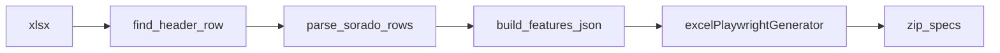

# 소라시도형 엑셀 표준으로 Excel → Playwright 재설계

## 0. 방향 정리 (사용자 피드백 반영)

- **표준 엑셀 =** `테스트케이스_ex.xlsx`류: `정책 ID`, `테스트케이스ID`, `우선순위`, `1 Depth`~`7 Depth`, `사전조건`, `기대결과`, (브라우저/비고 열 등).
- **PRD vs 소라시도 이중 모드 분기는 하지 않는다.** 기존 `테스트명`/`action`/`target` 기반 포맷은 제거하거나, 필요 시 별도 레거시 도구로만 유지(본 계획 범위에서는 **단일 파이프라인**).
- 상단에 요약·차트 블록이 있어 행 번호가 시트마다 달라질 수 있으므로, **“헤더 행 찾기”**는 한 포맷 안의 **탄력적 시작 행** 처리이지, 포맷 A/B 구분이 아니다.

## 1. 참고 파일 구조 (고정)

경로 예: `.../workSoruce/솔라시도/테스트케이스_ex.xlsx`.

| 구간 | 내용 |
|------|------|
| 헤더 위 | 병원 현황·테스트 결과 요약 등 — **데이터로 파싱하지 않음** |
| 헤더 행 | `정책 ID`, `테스트케이스ID`, `우선순위`, `1 Depth`…`7 Depth`, `사전조건`, `기대결과`, … |
| 헤더 직후 1행 | 브라우저 `ver.` 등 보조 헤더 — **스킵** |
| 이후 | 정책별 TC 행; `기대결과`는 긴 서술형; **test-id 열 없음**이 기본 |

## 2. 현재 코드와의 관계

- [`excelParser.ts`](apps/api/src/excelParser.ts): PRD 전용 → **소라시도 표준 전용으로 재작성**(헤더 행 탐색 + 열 매핑 + 행→레코드).
- [`excelTestCaseTypes.ts`](apps/api/src/excelTestCaseTypes.ts): `ExcelStep`/`ExcelAssertion` 중심 → **TC 행 모델**(정책·케이스 ID·depth·전제·기대) + generate가 소비하는 **중간 표현**(예: `GeneratedTestCase`)으로 정리.
- [`excelPlaywrightGenerator.ts`](apps/api/src/excelPlaywrightGenerator.ts): `click`/`input`/`navigate`만 가정 → **(1) 스캐폴드 spec**: `test.describe(정책)`, 각 행 `test('TC-{id} …')` + `기대결과`/`사전조건`을 안전한 블록 주석 또는 `test.info().annotations` 등으로 삽입; **(2) 선택 열**이 템플릿에 추가되면 그 행만 실제 Playwright API 라인 생성(팀이 열 정의 합의).

## 3. JSON 출력 설계 (API `features`와 정합)

- `features[]`: 시트(또는 정책) 단위 그룹.
  - 권장: **`feature` = `{sheetName}_{policyId}`** (한 시트에 정책 여러 개 가능).
  - `scenarios[]`: 정책 단위로 묶거나, 플랫하게 “한 행 = 한 시나리오” 중 팀 규칙 선택 — **권장: 한 정책 = `test.describe` 하나**, 내부는 **한 TC ID = `test()` 하나** (재실행·리포트 단위에 유리).
- 각 `test`에 매핑되는 객체 필드: `caseId`, `priority`, `depthPath[]`, `precondition`, `expected`, `browserNotes?` 등.

## 4. `excelPlaywrightGenerator` 재설계 요지

- **기본 산출:** 실행 가능한 클릭/입력 체인 없이도 **유효한 `.spec.ts`** — `test.fixme` 또는 본문에만 주석·`test.step` 설명, `expect`는 넣지 않거나 최소 placeholder.
- **문자열 안전:** `기대결과` 내용은 `JSON.stringify`로 한 줄 문자열 annotation에 넣거나, 블록 주석 시 `*/` 차단 규칙 적용.
- **파일명:** `sanitizeSpecBaseName(policyId 또는 feature)` 유지·확장.
- **선택 자동화 열(후속):** 예: `test_id`, `action`, `value`, `assertion` 열을 템플릿 오른쪽에 추가하면 해당 행은 기존 PRD와 동일한 코드 라인 생성 — **한 generator**에서 “스캐폴드 + 옵션 스텝” 분기.

## 5. API / 검증 / UI

- [`excelBodyValidate.ts`](apps/api/src/excelBodyValidate.ts): 새 `features` 스키마 검증.
- [`index.ts`](apps/api/src/index.ts): parse/generate 요청·응답 필드명을 새 모델에 맞춤 (`testCases` 페이로드 구조 동기화).
- [`ExcelPlaywrightPanel.tsx`](apps/web/src/components/ExcelPlaywrightPanel.tsx): 설명 문구를 소라시도 표준 기준으로 수정.
- [`README.md`](README.md): 열 정의·헤더 위 요약 무시·ZIP이 “실행 스캐폴드”임을 명시.

## 6. 데이터 흐름 (단일 포맷)

## 7. 테스트

- 최소 행 배열 또는 작은 **fixture xlsx**로: 헤더 탐지, Depth 조립, 정책별 그룹, 생성된 TS에 `TC-` + caseId 포함 여부.

## 8. 레거시 PRD 포맷

- 본 재설계 **범위에서는 제거**하는 것을 기본안으로 한다. 과거 샘플이 필요하면 Git 히스토리 또는 README “이전 포맷” 절만 남긴다.
